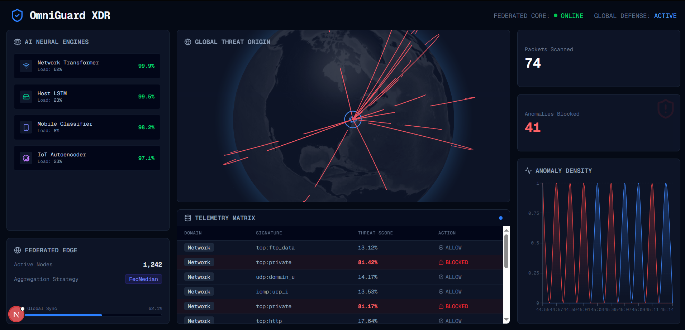
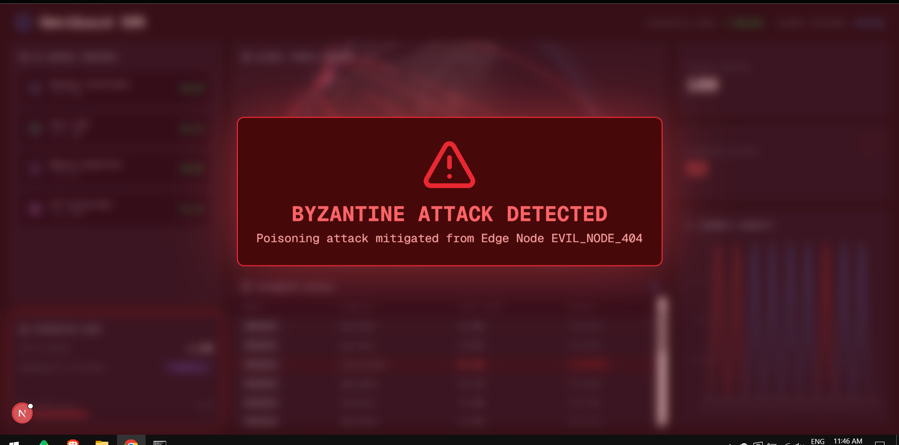
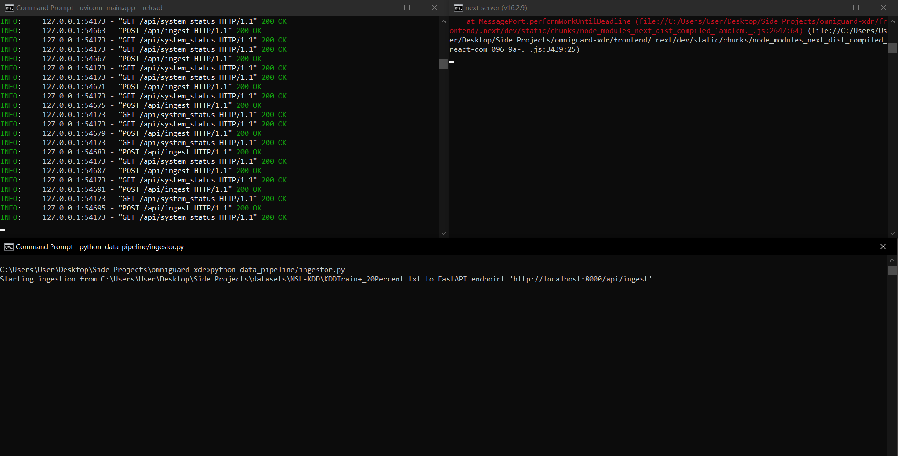

# OmniGuard XDR

OmniGuard XDR is a next-generation Extended Detection and Response platform that leverages Federated Learning and PyTorch Neural Networks for privacy-preserving, real-time cyber threat detection. The architecture pairs a high-performance Python FastAPI backend with a zero-latency Next.js Security Operations Center (SOC) dashboard.



## Core Architecture


### 1. Deep Learning Threat Detection
The system integrates a custom PyTorch `NetworkTransformer` architecture designed to process live network traffic flows (simulated via the NSL-KDD dataset). Incoming packets are converted into numerical tensors and passed through a forward network to generate mathematically rigorous threat probability scores.

### 2. Federated Learning Engine
Rather than relying on centralized data aggregation, OmniGuard distributes model weights to geographical edge nodes. The orchestrator actively utilizes a Byzantine Fault Tolerance algorithm (FedMedian) to mitigate model poisoning attacks from compromised or malicious nodes, ensuring global model integrity.



### 3. Geographical Threat Visualization
The platform features an interactive, dynamic WebGL 3D Globe powered by `react-globe.gl`. The visualization algorithm charts the physical trajectory of detected network anomalies in real-time by generating high-contrast vectors between the attacker's physical origin and the central aggregator.

### 4. Real-Time Telemetry Pipeline
A high-throughput `asyncio` WebSocket pipeline guarantees instant packet processing. The pipeline streams network matrices directly from the ingestor script through the deep learning inference engine and into the React frontend.



## Live Demonstration

A complete demonstration of the system's capabilities, including the 3D globe visualization, live packet streaming, and the Byzantine attack mitigation response, is available below:

[Watch the Demonstration Video](assets/demo%20video.mp4)

## Installation and Deployment

### 1. Backend Initialization (FastAPI and PyTorch)
Navigate to the backend directory, install the required dependencies, and launch the ASGI server.
```bash
cd backend
pip install -r requirements.txt
uvicorn main:app --reload
```

### 2. Frontend Initialization (Next.js)
Navigate to the frontend directory, install node modules, and start the development server.
```bash
cd frontend
npm install
npm run dev
```

### 3. Data Ingestion Simulation
In a separate terminal, execute the data pipeline script to simulate a live, continuous network tap.
```bash
python data_pipeline/ingestor.py
```

### 4. Federated Attack Simulation
To test the Byzantine Fault Tolerance defenses, execute the attack simulator script. The system will attempt to poison the global model, and the dashboard will display the automated mitigation response.
```bash
python federated/attack_simulator.py
```

## Technology Stack
- **Frontend Development:** Next.js, React, Tailwind CSS, Recharts, Lucide, React-Globe.GL, Three.js
- **Backend Architecture:** Python, FastAPI, WebSockets, Uvicorn, Asyncio
- **Machine Learning:** PyTorch, NumPy

---
*Architected and Developed by [YounisJ](https://github.com/YounisJ)*
